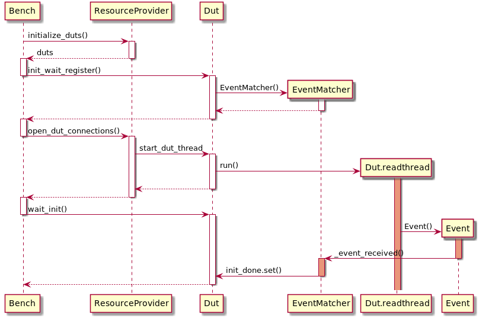
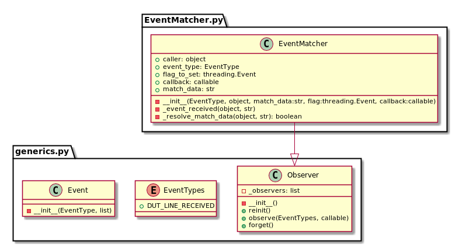

# Event API
IcedTea offers a simple event system, which is described in
here. The Event system consists of events, observers and event matchers.

## Events and Event types
The Event class is described in [Generics.py.](../icedtea_lib/Events/Generics.py)
The Event takes a type and arguments used in the callback
to the Observers observing that event.
The *args format is used for these callback arguments.

Currently IcedTea offers only one event type:
EventTypes.DUT_LINE_RECEIVED,
which is also defined in
[Generics.py.](../icedtea_lib/Events/Generics.py)

### Usage
Events can be generated for observers just by instantiating an Event
object anywhere in your code. All observers will be notified when the
Event is created. Events are not stored anywhere so observers will not
be able to find events that were created before the observer was set to
observe them.

## Observers
The Observer-class is also defined in
[Generics.py.](../icedtea_lib/Events/Generics.py)
It consists of a static list of all observers and some functions which
are used to register new observers and forget previous ones.

### Usage
When creating a class that you wish to observe some events, you can
inherit the Observer class. Remember to call the Observer __init__
function in your class __init__ function and to use the observe-function
to register the Observer to observe an EventType.

## EventMatcher
The EventMatcher class is defined in
[EventMatcher.py.](../icedtea_lib/Events/EventMatcher.py)
The EventMatcher is an Observer that observes
for DUT_LINE_RECEIVED events and matches the received line
contents to regular expressions or string provided to it,
setting a flag and/or calling a callback function if a match is found.
String is matched by looking for the match string
inside the entire line received (does not need to match whole line).
Reference to Event source can be provided as caller-argument.
If set to None (default) all Events will be matched.

### cli_ready_trigger mechanism
IcedTea has one integrated functionality for EventMatcher,
which stops the cli initialization process and
waits until the cli in the application is ready.
This can be enabled for each dut by adding
"cli_ready_trigger": <string> into the Dut requirements under
the "application" key. This mechanism is
described in this sequence diagram:

The timeout related to this feature can also be adjusted by adding
"cli_ready_trigger_timeout" : <integer> inside the same "application"
dictionary as the "cli_ready_trigger" key. The default value for this
timeout is 30 seconds.

#### Known issue
There is a known issue with cli_ready_trigger mechanism with fast
starting applications. The procedure during dut initialization is as
follows:

- Flash binary to dut
- Start listening for init ready trigger
- Open connection to dut
- Wait for init trigger

If the init trigger arrives before the connection is opened
it will be lost. This issue can be worked around by adding the--reset
option, which might not always be a viable solution.

### Usage
To use the EventMatcher, create an EventMatcher object. The constructor
takes the following arguments:
An *EventType*, the *Dut* whose events you wish to observe,
a string to match the event lines with (if this argument
starts with "regex:" the string will be split from : and the right side
is compiled into a regular expression pattern used for matching.
The last two arguments are the optional *flag*, which needs to implement
a *set()* method and *callback*, which is called with the line data when
a matching event is found. The *flag.set()* method is also called when
a matching event is found.

## UML

